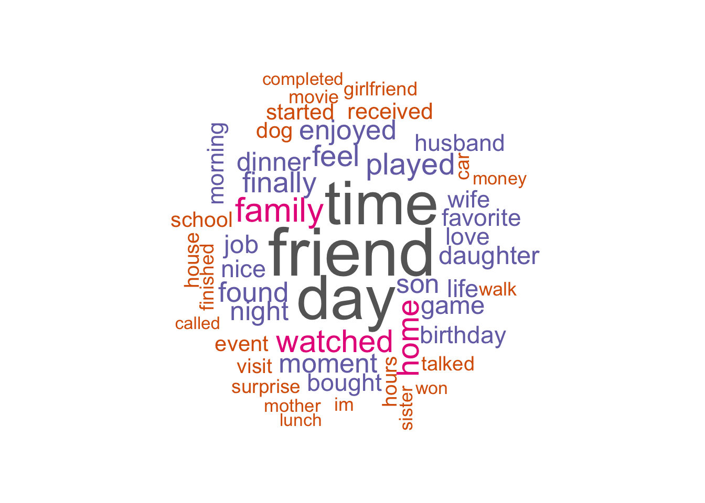
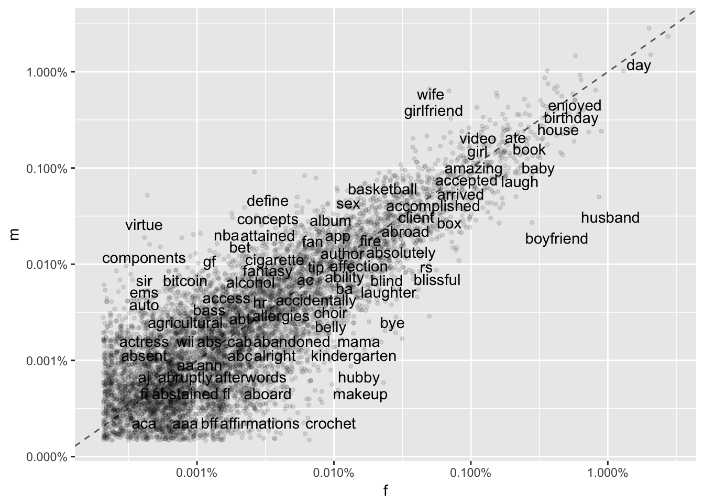
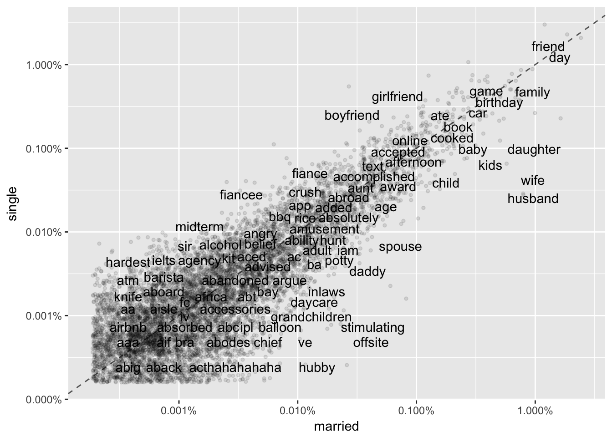
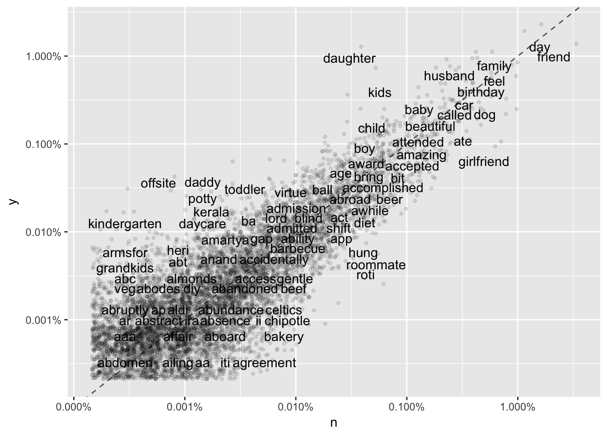
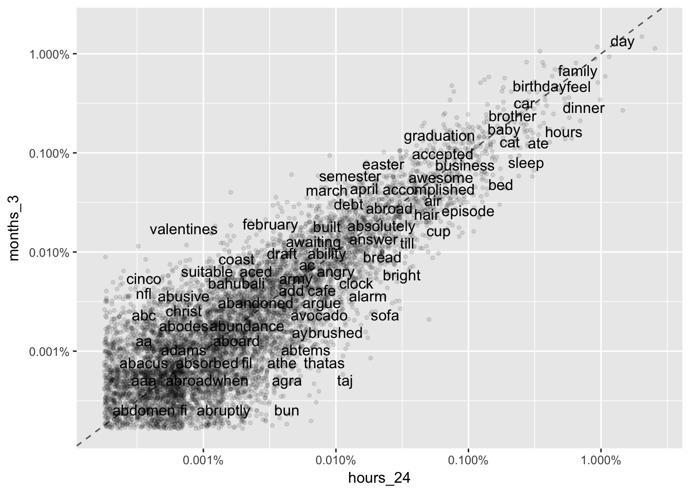
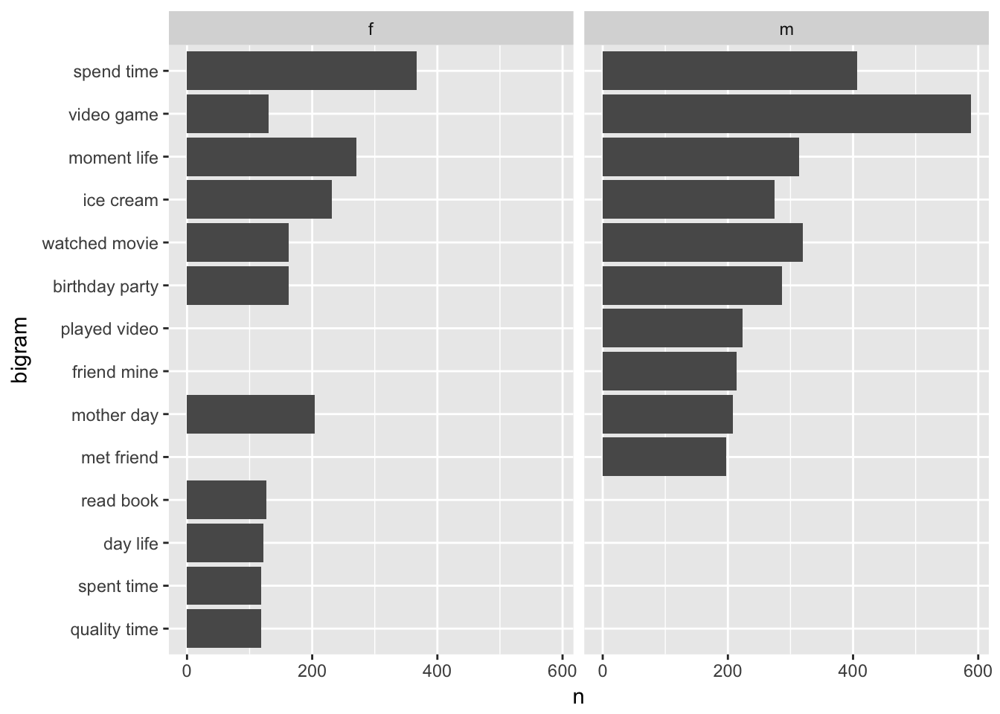
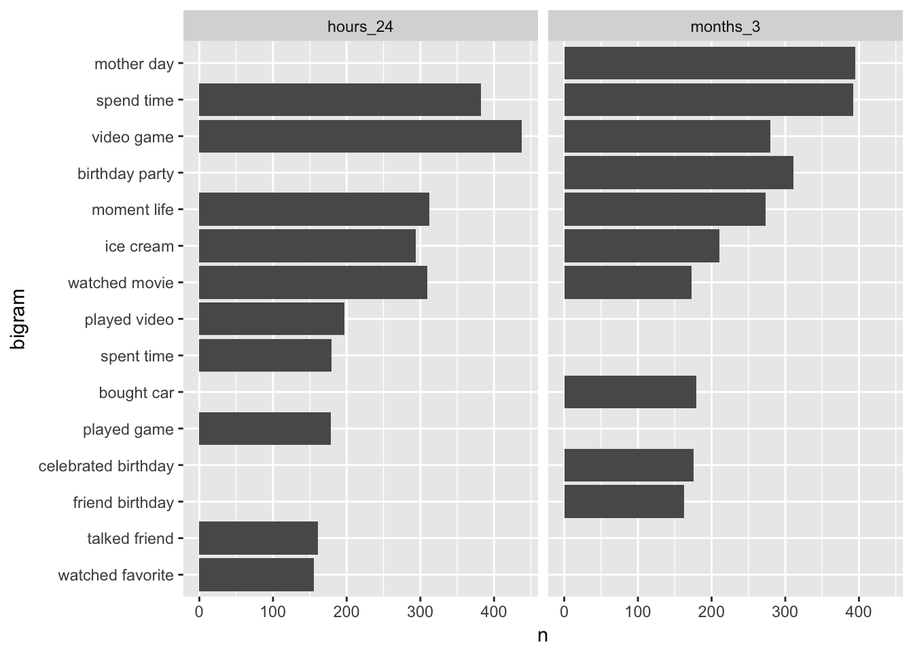

# Applied Data Science @ Columbia
## Fall 2018
## What AROUSE The Sense of Happiness of Different Groups of People
Jiayi Cui, jc4884

#Happy moment key words

The 50 most frequent words contain words that are natually connected with happiness such as friend, family, love and surprise. Also, there are words like day, time, finally, called that have a vague connection with happiness but we can make resonable inference about the connection.

## Question: what sustance of happiness did the most frequent words reveal?

Top 10 most frequent words are 'friend, day, time, family, watched, home, played, feel, finally, found'. Among them, 'friend', 'family' and 'watched', 'played' show the actual things or things people do that arouse the sense of happiness, while 'day', 'time' and 'feel' may be infered as the words that  people use to describe the sense of happiness. Words like 'finally', 'found' sound more like indicating a sense of achievement, which lead to sense of happiness.

## Why the most frequent words do not straightly point to actual things that make us happy?

# Because they apply to almost every one.
As the top 10 words about happiness, these words apply to all kinds of people, male or female, married or single, elderly or students. Therefore, there're only a few words talking about actual things that can make all groups of people happy, such as 'family' and 'friend', while most of the top 10 words, are talking about things that are not so specific, just like 'day', 'time' and 'feel', which describe happiness itself, and can't be too specific. 
To dig into things that arouse the sense of happiness, we need to analyze by group.

## Happy monment key word by property

The two genders actually have common things that arouse their happiness, although that may be expressed in different words. For example, husband and boyfriend are making female happy, while wife and girlfriend are making male happy. We can summarize that spouse or lover makes people happy. Meanwhile, 'birthday', 'house', 'ate', 'video', 'buy', 'kids' are things that provide happiness to both groups. 

But if we group people by their marital state, the two groups have less in common. More specifically, married people have things that make them happy, which are not owned by the single group. Happiness of the married is often associated with kids, including words 'daughter', 'baby', 'child'. The common things of these two groups are 'friend', 'birthday', 'finally', 'ate', 'cat', 'book', 'house', and, lover. Among these words, 'finally' is confusing, which we will discuss later. 

One thing that's interesting I found in this graph is the word 'ate'. This word appears at the top-right corner of all the 4 graphs above, showing that eating arouse the sense of happiness among all groups of people, both in long and short period. But here we see eating are more likely to make people happy in a short period, and can be much more specific. For example, under the 45 degree line, we see words like 'ice' (which is probably 'ice cream'), 'delicious', 'cup', 'cheese', 'bread'.

## What do confusing words mean?
We made some guesses about confusing words above like 'ice', 'finally', 'watched'. Now we may use bigram analysis to see what they actually mean.

Remember we saw 'video' made both male and female happy. Here 'video' appears in both male and female's top 10 happiest word pairs. Furthermore, 'video game' is the most frequent word pair showing in male's happy momonts. We also found word 'played video' in  the top 10 word pairs of male. If we use trigram, 'played video game' should be top one expression of male. We conclude that playing video game is an important thing that arouse sense of happiness among male, and it also makes female happy but not as strong.
We also find out what 'ice' and 'watched' mean. 'Ice' means 'ice cream', just like we guessed. Interestingly, 'met friend' is in the top 10 word pairs of male while 'read book' is in that of female.

Again, video game shows in both married and single's top 10 word pairs, but playing video game is clearly more important in arosing the sense of happiness of single than that of married. Single people are happy because of friend, while married people are arosed the sense of happiness by reading book.
Another finding is the pair 'makes feel'. Note that the pair is 'makes feel' instead of 'feel happy', which probably indicates that the emotion behind 'feel' is various. This indicates that people's sense of happiness may not be directly arosed by actual things, but can also be aroused by another sense, such as sense of achievement. And compared to the single group, married people's sense of happiness is more likely to be arosed by other sense and emotion.

One thing I would point out here is the word pair 'bought car'. This pair has never appeared in other graphs before, so buying a car is a particular thing that arouses the sense of happiness of parents.

There are basically 3 things that arouse all groups of people's sense of happiness for both short and long period of time, which are video game, watching movie and ice cream. And almost all groups of  people are equally happy because of 'mother day' and 'birthday party'. However, word pairs about 'mother day' and birthday are among top pairs in a long period but not in short period. This may be because mothers' day and birthday do not happen everyday, which makes them appear less frequently than other word pairs. on the other hand, talking with friend and watching favorite something make people happy in 24 hours but don't last for long. Buying a car is one of the top 10 happiest moments in 3-month's period.
## Conclusion
What arouse the sense of happiness have clear difference among different groups of people, but there are several things in common: video game, ice cream, watching movie, birthday party, and mothers' day. on the other hand, certain things are important in arousing the sense of happiness for certain group of people. Friend is an important source of happiness for male, the single, and people who are not parents, while reading books is important to the happiness of female and the married. Particularly, buying a car is one of the top things that make people who are parents happy, and is also an important thing that arouses happiness in a long period.